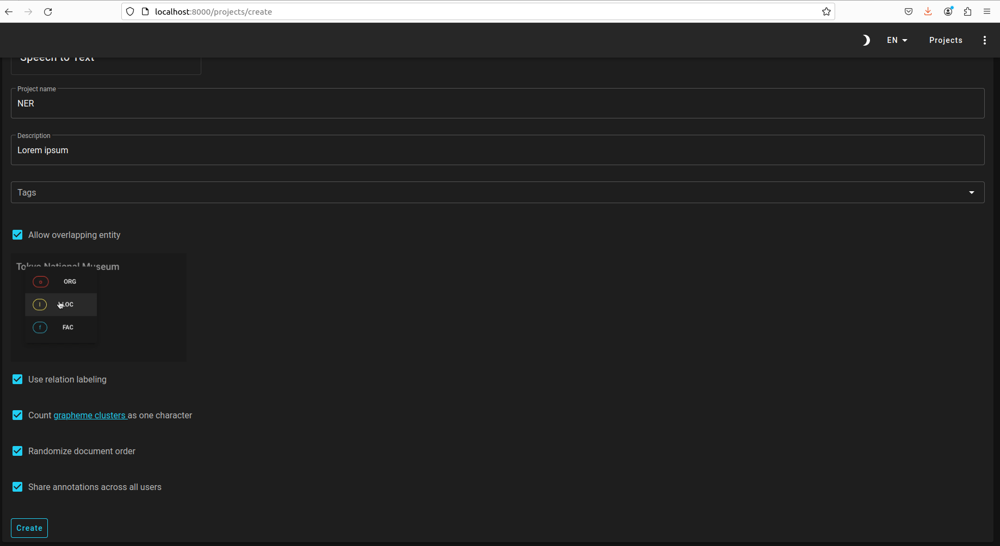
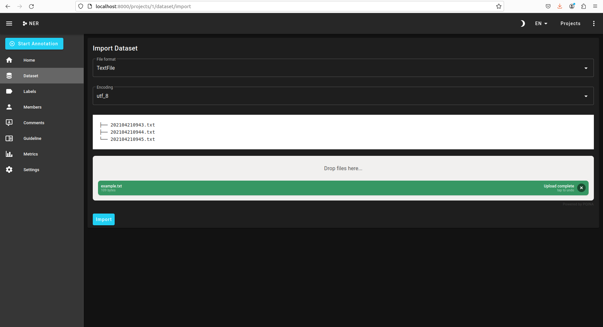
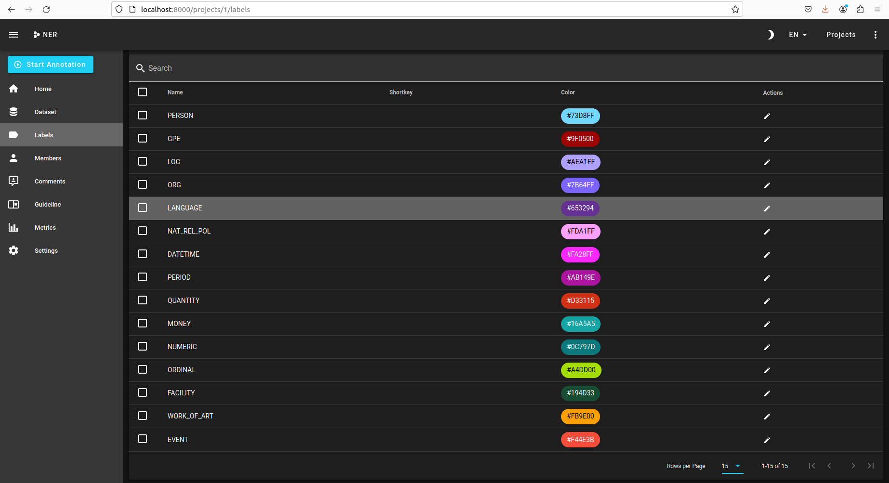
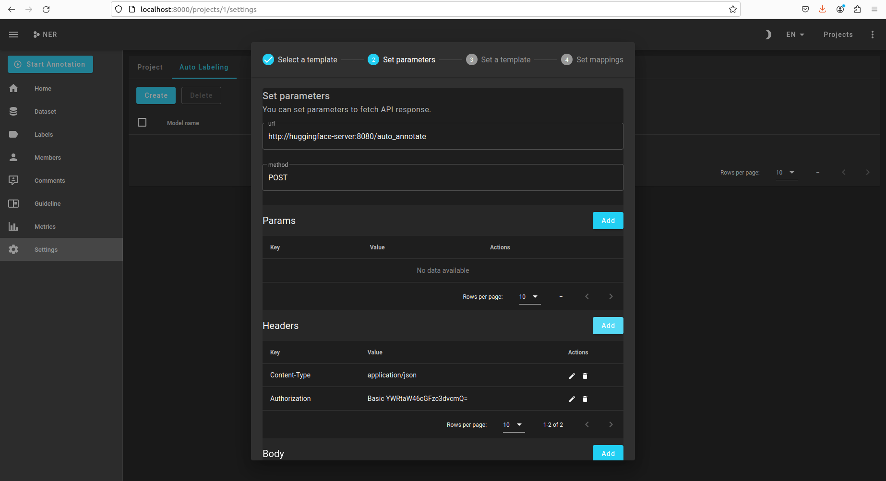
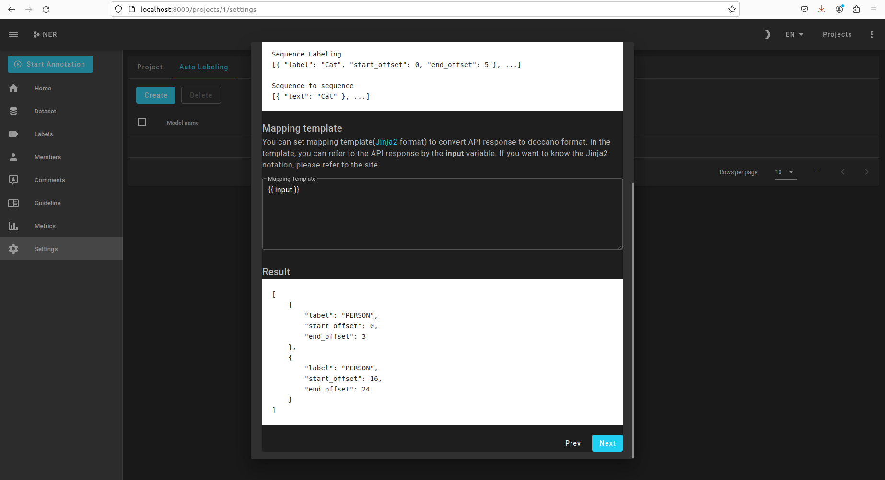
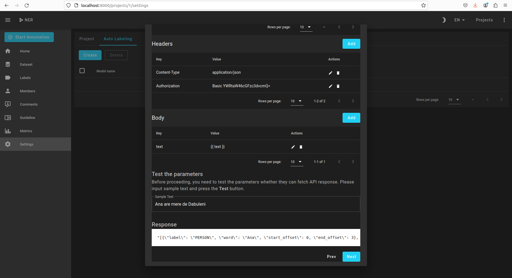
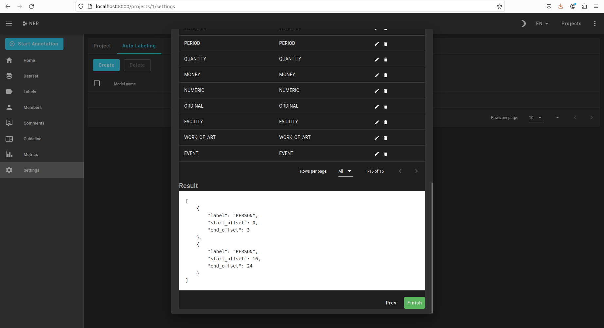

# Doccano annotation server with Huggingface backend

- [Doccano annotation server with huggingface backend](#doccano-annotation-server-with-huggingface-backend)
  - [Getting started](#getting-started)
    - [Spinning up the server](#spinning-up-the-server)
    - [Get data file that can be imported into doccano](#get-data-file-that-can-be-imported-into-doccano)
  - [Configure Doccano](#configure-doccano)
    - [Create a project](#create-a-project)
    - [Import Dataset](#import-dataset)
    - [Create Labels](#create-labels)
    - [Enable Auto Labeling](#enable-auto-labeling)
      - [Select a template](#select-a-template)
      - [Set parameters](#set-parameters)
      - [Set a template](#set-a-template)
      - [Set mappings](#set-mappings)
  - [Training a custom model](#training-a-custom-model)
    - [Install necessary python dependencies](#install-necessary-python-dependencies)
    - [Export the dataset](#export-the-dataset)
    - [Create a `.huggingface` training file](#create-a-huggingface-training-file)
    - [Run the training](#run-the-training)
    - [Rebuild the image](#rebuild-the-image)

``` bash
fiete@ubu:~/Documents/programming/huggingface/doccano_huggingface$ tree -L 2 --dirsfirst
.

├── data                        # contains the source data
│   ├── example.txt
│   └── label_config.json
├── huggingface-server                # huggingface backend server
│   ├── app
│   ├── Dockerfile
│   └── run.sh
├── docker-compose.yaml
├── requirements
├── .env
└── README.md

9 directories, 13 files
```

## Getting started

### Spinning up the server
For proper authentication, you'll need to create a `.env` file with the following content in the root of this project:
```
HUGGINGFACE_USER=admin
HUGGINGFACE_PASSWORD=password
```
You can change the credentials to your liking, but make sure to also adjust the `Authorization` headers, as described in the [Server README](huggingface-server/README.md) and the [Set parameters](#set-parameters) step below.

``` bash
docker-compose up -d
```
Doccano should now be available on http://localhost:8000 in your browser (Credentials: admin, password)

Shut down:
``` bash
docker-compose stop
```

## Configure Doccano
Open the web UI at http://localhost:8000.
### Create a project

### Import Dataset
Files you import must have a specific format. You may use the `convert.py` to convert from a pandas dataframe to a `textline` file.

### Create Labels
You can create labels in the labels section (sidemenu). Labels can also be im- and exported (see the `data/label_config.json`).


### Enable Auto Labeling
Important: Make sure you have created your custom labels before setting this up!

#### Select a template
Navigate to Settings and select the Auto Labeling tab. Hit `Create` and select `Custom REST template`.

#### Set parameters
In the next step, we are specifying the request properties. This includes setting the `Content-Type` and `Authorization` headers and the request `Body`. For details on how to obtain the correct `Authorization` Header, also check the [Server README](huggingface-server/README.md).

If all is configured correctly, the test should return a valid response.


#### Set a template
Here we can customize the mapping between the response we get from the annotation backend (in this case the huggingface server) and doccano. For the mapping Jinja2 is used.


#### Set mappings
Finally we have to provide the mapping between the labels returned by the huggingface backend and the ones present in doccano. It looks like we have to provide this even in the case that they are identical.


## Training a custom model

### Install necessary python dependencies
``` bash
pip install -r requirements
```

### Export the dataset
In Doccano, go to the Datasets page and export the dataset. This will create a zip file containing the annotations per user, i.e `admin.jsonl` and `unknown.jsonl` which contains all the sections that have not been annotated yet.

In the `data` folder, create an `exported` folder and copy over the `admin.jsonl` file.


### Rebuild the image
If the containers are still running, use `docker-compose stop` to stop them. Now we can recreate them with:
``` bash
docker-compose up --build
```
